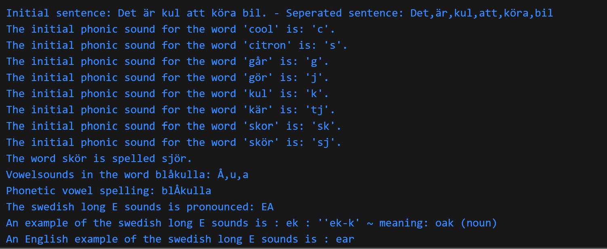

# Swedish Phonics Identifier
Has the ability to break down the phonics of Swedish words.
Currently supports the intial consonant sounds of:
- c
- g
- k
- sk

It also supprots the identification process of long or short vowel sounds in regular, non-compound words.

# Usage
The Swedish language has 9 vowels (A, E, I, O, U, Y, Å, Ä, Ö). This module can, by following standarad pronunciation rules, identify if the vowel sound in a word is long or short.

The vowels are split into two groups, hard and soft, which has an an impact on how a word is pronounced. Depending on if the vowel is hard or soft, the consonant sound which appears before the vowel may or may not be altered. This module therefore aims to identify the initial sound of a word, determine if it is affected by the vowel which follows, and provide the user with a response which tells us how to pronounce it.

Consonant sounds affected by soft vowels:
- C
- G
- K
- SK

**Hard vowels:** *A, O, U, Å*

**Soft vowels:** *E, I, Y, Ä, Ö*

# USAGE
The user should only have to interact with the file called 'swedish-phonics-module.js'. It can create a new instance of the class SwedishPhonicsIdentifier() and use the methods included to do the following:
1. returnAllWordsInString(input) - Splits a string into separate words
2. returnInitialConsonantSound(input) - Provides the initial phonetic sound of a word.
3. phoneticConsonantSpelling(input) - Provides the phonetic consonant spelling of a word.
4. returnAllVowelSounds(input) - Provides the vowel sounds included in a word. (Long vowel sounds will be capitalised, while short ones remain lower case)
5. phoneticVowelSpelling(input) - Provides the word rewritten to capitalise vowels that have a long vowel sound.
6. returnVowelSoundExplanation(input) - Returns an explanation of the sound, e.g. 'e' is pronunced 'eh'
7. returnVowelExample(input) - Returns an example word using the sound
8. returnVowelEnglishExample(input) - Returns an example of an English word using the sound

## Example outputs using the methods above

# Testing
In terminal: npm run test

In the folder named 'test-app', there is a file called 'test-each-method.js' which runs through all the current tests. Running 'npm run test' will run this file and print in the terminal.

# Open Issues
There are currently several limitations to the modules ability to correctly identify the phonics.

## Consonant sounds
- The module only identifies the intial consonant sound of a word. If the consonant is altered within a word, it is not detected.
- Several additional consonant sounds are yet to be added, such as 'dj', 'lj', and 'hj'.
- Known exceptions are not stored or dealt with, for example 'kö'.
- Homographs (words that are spelled the same but pronunced differently) are currenlty not addressed, e.g. 'kör' (choir) and 'kör' (driving)

## Vowel sounds
- Compound words are currently not dealt with, e.g. 'solljus' would be considered a short 'o'-sound, despite the word consisting of two parts sol-ljus.
- If it is a noun, it must be entered in singular, undetermined form (e.g. '***katt***', not '*katter*' or '*katten*')
- If it is a verb, it must be entered in its base (infinitive) form (e.g. ***'springa'***, not *'springer'*)
- Strong verbs, where emphasis is placed on the last vowel syllable, are not accounted for and would generate false results (e.g. ***'begå'***)

## Error handling
There is currently no proper error handling implemented. There is currently a method available called catchTypeError(input) in the SwedishPhonicsChecker that is ready to be implemented. However, due to the nature of this method, which throws a TypeError if an incorrect argument is entered but does not catch it, this is something which should be improved.
