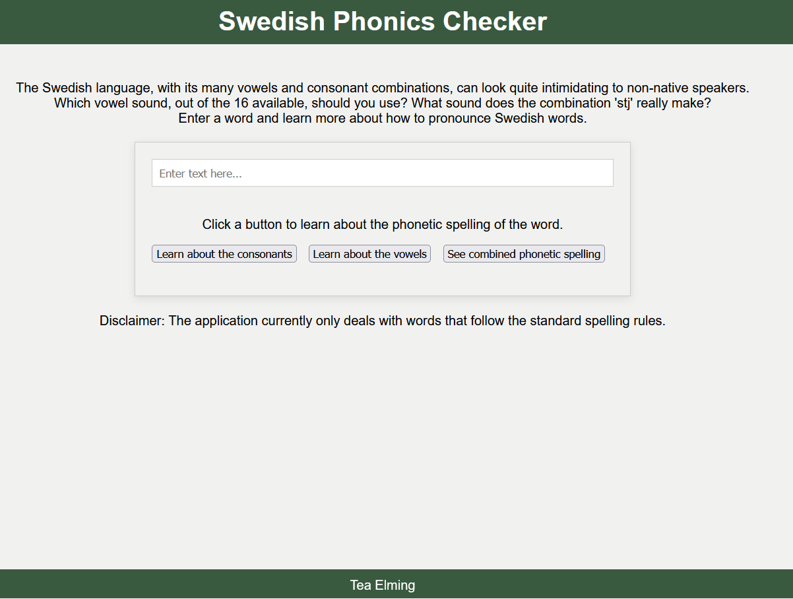

# Swedish Phonics Checker Project

The Swedish Phonics Checker project consists of two main parts: a [module](/src/components/modules/) and an interactive [application](/src/components/app/). It is designed to assist non-native Swedish speakers in learning how to correctly pronounce Swedish words, focusing on vowel and consonant sounds. The phonetic sounds are described based on English phonics, making this most suitable for native English speakers, wishing to understand how to pronunce Swedish words.

## Table of Contents
- [Swedish Phonics Checker Project](#swedish-phonics-checker-project)
  - [Table of Contents](#table-of-contents)
  - [Overview](#overview)
      - [See video of app](#see-video-of-app)
  - [Project Structure](#project-structure)
  - [Access](#access)
    - [Using the entire project](#using-the-entire-project)
  - [Features](#features)
  - [Development](#development)
  - [Testing](#testing)
  - [Information about Swedish Phonics](#information-about-swedish-phonics)
    - [Learn more about vowels](#learn-more-about-vowels)
  - [Open Issues](#open-issues)
    - [Consonant sounds](#consonant-sounds)
    - [Vowel sounds](#vowel-sounds)
    - [Error handling](#error-handling)
  - [License](#license)

## Overview
The project is split into two main parts:
1. **Swedish Phonics Checker - Module:** A JavaScript module providing functionalities to analyze Swedish words, identify vowel and consonant sounds, and provide phonetic spellings.
   - [Read more about the module](/src/components/modules/README.md)
2. **Swedish Phonics Checker - App:** An interactive application that utilizes the module to provide a user-friendly interface for learning Swedish phonetics.
   - [Read more about the app](/src/components/app/README.md)

#### See video of app
Click the image to view a video of the app in action.

## Project Structure

- `modules`: Contains the Swedish Phonics Checker module.
- `app`: Contains the source code for the interactive application.
- `README.md`: This main project README.

## Access
This project is open for use, and developers and Swedish language enthusiasts are encouraged to take advantage of the resources provided. However, to maintain the integrity of the original project and allow for independent development, please follow these guidelines:

### Using the entire project
1. **Fork the repository**: Create a copy of the project by forking.
2. **Clone your fork**: clone to our local machine.
3. **Set up and run**: Follow the ser up instructions in this README [(see below)](#development)

## Features

* **`Phonetic Analysis:`** Analyse Swedish words to identify vowel and consonant sounds.
* **`Interactive Learning:`** A user-friendly application to interactively learn about Swedish phonetics.
* **`Phonetic Spelling:`** Provides phonetic spelling of Swedish words based on pronunciation rules.

## Development

To contribute to this project, please follow the standard GitHub fork-and-pull request workflow:

1. **Fork** the repository on GitHub.
2. **Clone** the project to your own machine.
3. **Commit** changes to your own branch.
4. **Push** your work back up to your fork.
5. Submit a **Pull request** so that we can review your changes.

## Testing

Unit tests are available for the module, ensuring that each phonetic analysis functionality works as expected.

    npm install
    npm test

Unit tests have been written for each method in the module. These are run through when running npm test.

## Information about Swedish Phonics
The most important thing to master when learning to speak Swedish is the vowel sounds. After that, there are a few consonant combinatinos that create sounds that you may not be familiar with.

Swedish words are written fairly phonetically - assuming you know a few rules. This project aims to help learners clarify the pronunciation of a word, by applying the rules and returning the logical pronunciation.

### Learn more about vowels

The Swedish language has 9 vowels (A, E, I, O, U, Y, Å, Ä, Ö), but 16 vowel sounds. Each vowel has a long and a short sound - the long one is what you would hear if you listened to an alphabet song, while the short ones are fairly similar to English vowel sounds. However, just like there are many different English accents, there are also many differetn Swedish pronunciations. The rules and explanations in this project have been generalised to fit as many as possible.

The vowels are split into two groups, hard and soft, which has an an impact on how certain consonants apeparing before them are pronounced. In this project, consonant sounds are analsyed based on the vowel that follows.

## Open Issues
There are currently several limitations to the modules ability to correctly identify the phonics.

### Consonant sounds
- The module only identifies the intial consonant sound of a word. If the consonant is altered within a word, it is not detected.
- Known exceptions are not stored or dealt with, for example 'kö'.
- Homographs (words that are spelled the same but pronunced differently) are currenlty not addressed, e.g. 'kör' (choir) and 'kör' (driving)

### Vowel sounds
- Compound words are currently not dealt with, e.g. 'solljus' would be considered a short 'o'-sound, despite the word consisting of two parts sol-ljus.
- If it is a noun, it must be entered in singular, undetermined form (e.g. '***katt***', not '*katter*' or '*katten*')
- If it is a verb, it must be entered in its base (infinitive) form (e.g. ***'springa'***, not *'springer'*)
- Strong verbs, where emphasis is placed on the last vowel syllable, are not accounted for and would generate false results (e.g. ***'begå'***)

### Error handling
There is currently no proper error handling implemented. There is a method available called catchTypeError(input) in the SwedishPhonicsChecker that is ready to be implemented. However, due to the nature of this method, which throws a TypeError if an incorrect argument is entered but does not catch it, this is something which should be improved.

## License
This project is licensed under the MIT License - see the [LICENSE.md](LICENSE.md) file for details.
