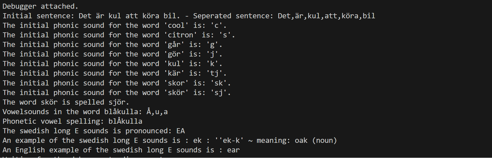

# The Phonics Breakdown Module
This module aims to help users with the phonetic breakdown of Swedish words.

The module provides the initial consonant sounds for words dependant on their spelling.
The module can also break down the type of vowel sounds used in a word, if they are long or short.

The test app consists of 8 tests, all run at the same time. Preferred method of testing would be to use a framework such as Jest.

## How to run tests
1. run 'npm run test' in terminal
2. observe console

## Test-Plan
### What to test and how
The intention is to write and run individual tests for each use case in a test app. The tests should return a desired outcome in our console. The test app will run all tests at once, but they can be commented out if the desire is to only check one at a time. More test cases can be added to the test app if more functionality needs to be tested.

### Test cases
#### TC1 - returnAllWordsInString()
Use Case: Turn a string into an array of words

Input: 'Det är kul att köra bil.'
Expected output: ['Det', 'är', 'kul', 'att', 'köra', 'bil ']

##### Expected Outcome
The string should be represented as an array with each word represented as an individual element in the console. The test prints in the form of:
  console.log(`Initial sentence: ${sentenceToSplit} - Seperated sentence: ${seperatedWords}`)

#### TC2 - returnInitialConsonantSound()
Use Case: Return consonant sound corresponding to the spelling of the input.

Input: ['cool', 'citron', 'går', 'gör', 'kul', 'kär', 'skor', 'skör']
Expected output:
    The initial phonic sound for the word cool is: 'c'.
    The initial phonic sound for the word citron is: 's'.
    The initial phonic sound for the word går is: 'g'.
    The initial phonic sound for the word gör is: 'j'.
    The initial phonic sound for the word kul is: 'k'.
    The initial phonic sound for the word kär is: 'tj'.
    The initial phonic sound for the word skor is: 'sk'.
    The initial phonic sound for the word skör is: 'sk'.

##### Expected Outcome
The corresponding consonant sound of the word should be returned. The test prints a string showing the word and the sound in the form of:
    console.log(`The initial phonic sound for the word '${word}' is: '${initialPhonicSound}'.`)

#### TC3 - phoneticConsonantSpelling()
Use Case: Return input word with phonetic consonant spelling.

Input: 'skör'
Expected output: 'The word skör is spelled sjör.'

##### Expected Outcome
The intial word should be rewritten with the correct consonant sound. The test prints a string showing the word and the sound in the form of:
  console.log(`The word ${wordToSpellPhonetically} is spelled ${phoneticallySpelledWord}.`)

#### TC4 - returnAllVowelSounds()
Use Case: Return array of vowel sounds identified in a word.

Input: 'blåkulla'
Expected output: ['Å', 'u', 'a']

##### Expected Outcome
The vowel sounds present in the word should be returned, where upper case represents long vowel sounds and lower case represents short vowel sounds. The test prints a string showing the word and the sound in the form of:
  console.log(`Vowelsounds in the word ${wordToTry}: ${allVowelSounds} `)

#### TC5 - phoneticVowelSpelling()
Use Case: Return input word with phonetic vowel spelling.

Input: 'blåkulla'
Expected output: blÅkulla

##### Expected Outcome
The intial word should be rewritten with the correct vowel sound. The test prints in the form of:
  console.log(`Phonetic vowel spelling:  ${allVowelSounds}`)

  #### TC6 - returnVowelSoundExplanation()
Use Case: Return the sound of a Swedish vowel, upper case letters give long vowel sounds, lower case give short vowel sound.

Input: 'E'
Expected output: 'EA'

##### Expected Outcome
The explanation of the vowel sound should be returned. The test prints a string showing the sound in the form of:
  console.log(`The swedish long E sounds is pronounced:   ${vowelSoundExplained}`)

#### TC7 - returnVowelExample()
Use Case: Return a Swedish word using the specific vowel sound, upper case letters give long vowel sounds, lower case give short vowel sound.

Input: 'E'
Expected output: 'ek : 'e-k ~ meaning: oak (noun)'

##### Expected Outcome
An example of a Swedish word using the specific vowel sound should be returned. The test prints a string showing the sound in the form of:
  console.log(`An example of the swedish long E sounds is :  ${vowelSoundExample}`)

#### TC8 - returnVowelEnglishExample()
Use Case: Return an English word using the specific vowel sound, upper case letters give long vowel sounds, lower case give short vowel sound.

Input: 'E'
Expected output: 'ear'

##### Expected Outcome
An example of an English word using the specific vowel sound should be returned. The test prints a string showing the sound in the form of:
  console.log(`An English example of the swedish long E sounds is :  ${vowelSoundEnglishExample}`)

## Test Report

| Test               | Expected Outcome |
|--------------------|:----------------:|
| TC1                |       1/OK       |
| TC2                |       1/OK       |
| TC3                |       1/OK       |
| TC4                |       1/OK       |
| TC5                |       1/OK       |
| TC6                |       1/OK       |
| TC7                |       1/OK       |
| TC8                |       1/OK       |
| COVERAGE & SUCCESS |       PASS       |

### Comments
All base methods pass fine, but error handling for entering incorrect argument types needs to be addressed.

