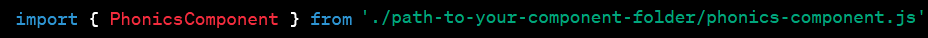
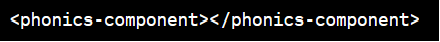

# Swedish Phonics Checker App

The Swedish Phonics Checker app is an interactive component designed to help non-native Swedes understand how to pronounce Swedish words. It provides a user-friendly interface to input Swedish words and learn about their initial consonants, vowels, as well as the combined phonetic spelling.

## Table of Contents
- [Swedish Phonics Checker App](#swedish-phonics-checker-app)
  - [Table of Contents](#table-of-contents)
  - [Features](#features)
  - [Installation](#installation)
  - [Usage](#usage)
  - [Development](#development)

## Features
* **Interactive UI:** Users can input a Swedish word and click on buttons to learn about its phonetic spellings.
* Consonant Information: Learn about the consonants in the input word.
* **Vowel Information:** Learn about the vowels in the input word.
* **Combined Phonetic Spelling:** See the combined phonetic spelling of the entire word.
* **Support for Single Words:** Currently, the app supports phonetic consonant information for single words only.

[See video of usage](/explanationVideo.mp4)

## Installation
To use this app in your own project, follow these steps:
1. Ensure that you have the necessary components and modules available in your project. This includes:
   1. 'SwedishPhonicsChecker' from ['../../modules/swedish-phonics-module.js'](../modules/swedish-phonics-module.js)
   2. 'ConsonantComponent' from [../consonant-component/consonant-component.js](./consonant-component/consonant-component.js)
   3. 'VowelComponent' from [../vowel-component/vowel-component.js](./vowel-component/vowel-component.js)

2. Import the 'PhonicsComponent' in your main JavaScript file or module:
      
3. Add the 'phonics-component' element to your HTML:
      

## Usage
After adding the component to your HTML, you can use it as follows:

1. Enter a Swedish word in the input field.
2. Click on one of the three buttons to learn about the word’s consonants, vowels, or combined phonetic spelling.
3. The information will be displayed below the buttons.

## Development
To contribute to the development or modification of this component, follow the standard Git workflow:

1.  **Fork** the repository.
2.  **Clone** your fork to your local machine.
3.  Make your changes and **commit** them to your fork.
4.  Create a **pull request** to the original repository for review.

