# Reflection
A short summary of chapters 2 to 11 in Clean Code by Robert C. Martin

## Chapter 2: Meaningful Names
Chapter 2 of Clean Code discusses the importance of using good names for all different aspects of the code as good names makes it significantly easier to understand and interact with the code. The book emphasises that each name should answer three questions: why does it exist, what does it do, and how is it used? These three questions were constantly in the back of my mind when naming the various parts of the code, and there were several times when I renamed a variable, method, or even class upon reflection. An example of this was the class formally known as ConsonantSoundIdentifier, which was renamed as ConsonantMapper.
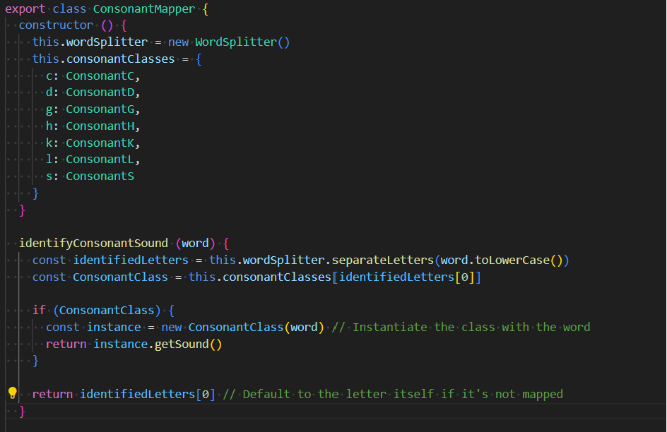

The purpose of this was to better represent what the class as a whole was doing. A base-consonant class existed, and the purpose of this class was to map the correct class based on the input. A method within the class is still called identifyConsonantSound, but there is also a method called rewritePhonetically(), which would not make as much sense within a class called ‘identifier’, as it does more than just identifying.

## Chapter 3: Functions
The most challenging aspect of the chapter about functions was to adhere to the “small, then smaller” rule, as well as “do one thing”. I understand the reasoning behind it, but it was very challenging to not do a couple of things within the same method, especially when it felt so logical at times. The biggest improvement for my code came from reading about the switch-statements. Previously, I had 3 ridiculously long switch statements within the same class, all violating both the Single Responsibility Rule and the Open Closed Principle, which have now been extracted and hidden behind dependencies.
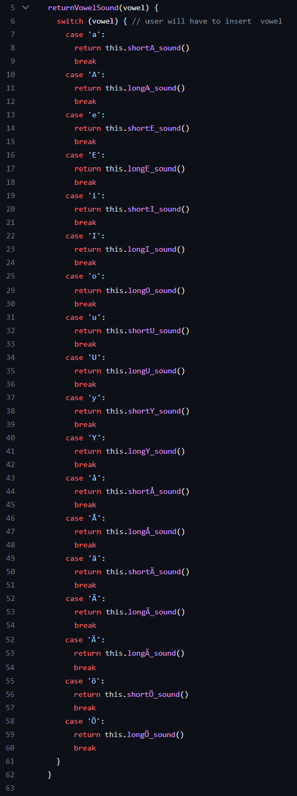
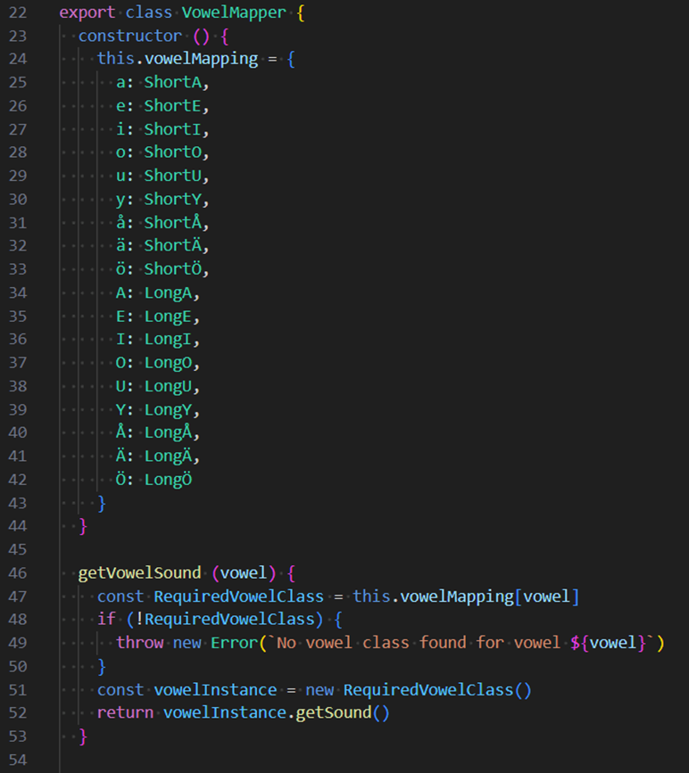

## Chapter 4: Comments
In the beginning of this degree, we were taught to always write JSDOC comments to go along with the code. However, Clean Code states that “It is just plain silly to have a rule that says that every function must have a javadoc, or every variable must have a comment. (p. 63)” Despite this rule, I really struggle to get out of the habit of using jsdocs, especially when using the LNU eslint, which requires jsdocs. However, I did disable the eslint requirement for jsdocs within some of the files, and tried to only add comments that would clarify the situation.
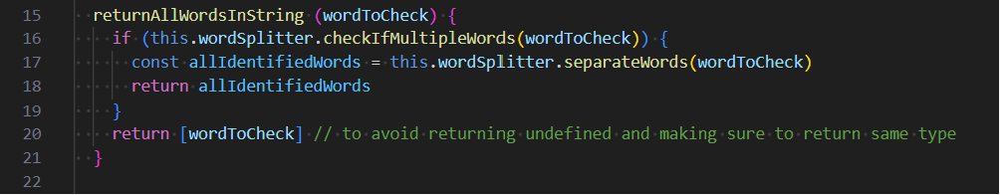

In this case, I am justifying why I chose to return the word, which may not have been completely intuitive otherwise.

## Chapter 5: Formatting
Clean Code states that a file should be structured like a newspaper; we should have a name which clearly tells us if we are in the right file, and then the methods should be structured in descending order based on the concept levels. High-level concepts should be further up, whereas lower-level details should be at the bottom. This required some restructuring as I wrote them in order of usage – so if A needs to be used in B, A will be written first. For dependant functions, I did intuitively follow the rules of the book, in the sense that A and B would always be close to each other vertically so that they can be seen at the same time within the same window.
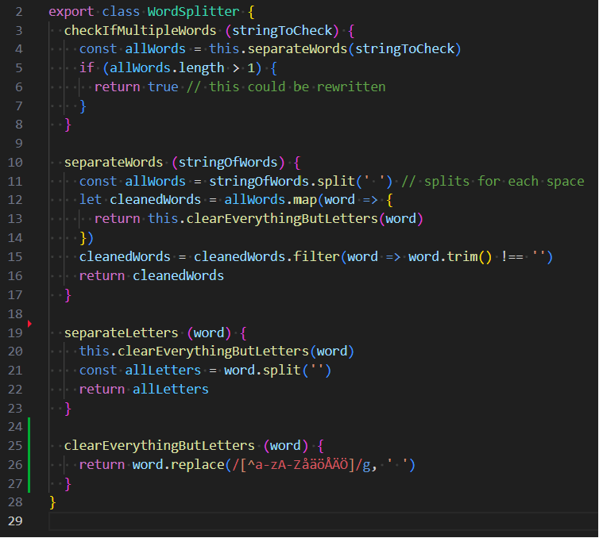
In this example, the code is written top to bottom in order of concept-level.

## Chapter 6: Objects and Data Structures
I found Chapter 6 surprisingly difficult to wrap my head around, especially the differentiation between the data structures and objects. However, I placed my focus on following Demeter’s Law, and not chaining objects and methods.
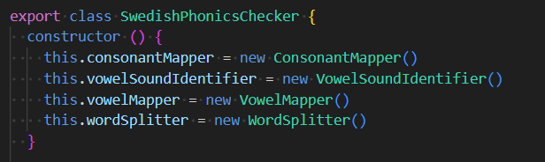
The instantiation of the objects in the constructor allows a close relationship with the objects used, further following Demeter’s Law.
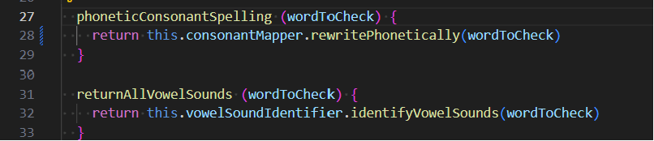
As can be seen from these two example methods, the class interacts with the objects without exposing the internal structures.

## Chapter 7: Error Handling TO DO BECAUSE I NEED MORE ERROR HANDLING
HJ

## Chapter 8: Boundaries
As creators of a module, we want to make it versatile and attractive to many potential users, while as users we want it to solve the specific problem that we have. I can honestly say that I had not considered either of these perspectives during the process of developing my module or my app,  but I did want to make sure that the module was easy to interact while only having to use a few method names. During the process of developing my module, I had the end user’s ease in mind more than how “sellable” it would be.
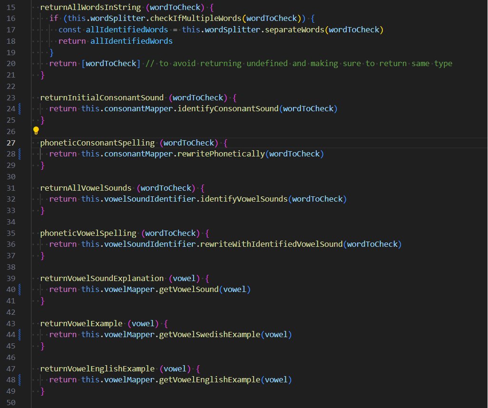
As a user of the module, you can achieve most things using these 8 methods.

## Chapter 9: Unit Tests
My module did not use unit tests at first, but it has now been updated to include over 120 unit tests. When writing the code, I did not follow “The three Laws Of TDD”, as I had not read this chapter when starting the process of building my project, and I had therefore not thought about the importance of writing unit tests before writing production tests. I do think that I kept my tests clean and to a good standard though, much thanks to the help of ‘ava’ test framework.
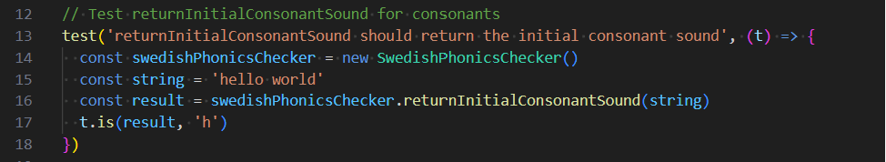

## Chapter 10: Classes
First of all, I can say that my classes are not as small as they could be. However, I have made a significant effort in trying to slim a lot of them down. Initially, I had a few classes that spanned hundreds of lines, whereas now the longest module-class is 81 lines, much due to several short methods being combined to check for a specific requirement. The classes do not strictly adhere to the Single Responsibility Principle, which is something that could be improved upon, but as can be seen below, they are fairly limited in what they do.
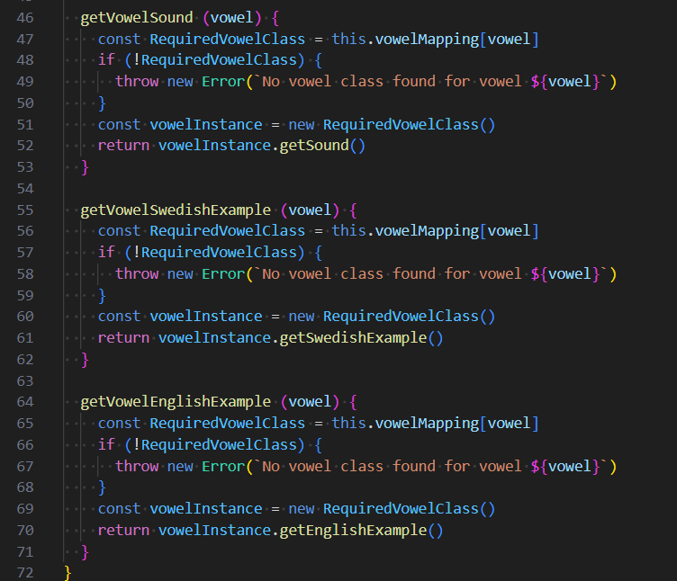
Above the visible methods is the mapping of the vowels, but the class only has three methods in it.

## Chapter 11: Systems
The initial module was designed in such a way that it would be very difficult to scale it up, there were a lot of things that needed to be altered for that. However, the revised module has been restructured to avoid using switch statements, and instead has separated the concerns of the letters and hides them behind dependencies which allow for easier modification of the individual classes and methods. Domain appropriate names have also been used to allow for better communication between “domain concept and the code that implements it”.
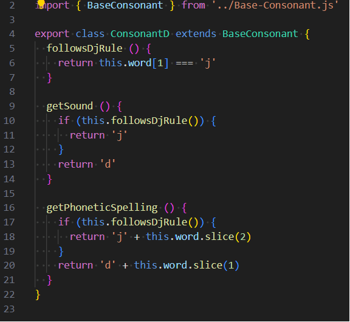
Example of how the consonant D has been separated into its own class.

 
