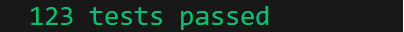

# Swedish Phonics Checker - Module
The SwedishPhonicsChecker-module aims to help non-native Swedish speakers pronounce Swedish words. Currently, the module supports vowel sound pronunciation, as well as consonant sounds appearing at the start of a word.

The Swedish language has 9 vowels (A, E, I, O, U, Y, Å, Ä, Ö). This module can, by following standarad pronunciation rules, identify if the vowel sound in a word is long or short.

There are certain consonants that are not pronunced as one might expect: the 'g' in 'gel' is not pronounced the same way as the 'g' in 'gul', and the words 'skar' and 'sker' have vastly different consonant sounds.

## Access
To find the file for the SwedishPhonicsChecker-module, press the link: [swedish-phonics-module.js](./swedish-phonics-module.js) . Please fork it to work on your own project.

To find all files required for the SwedishPhonicsChecker-module, please click here: [modules-folder](../modules)

# How to interact with the module
Create a new instance of the class SwedishPhonicsIdentifier() and work with the following methods:
1. returnAllWordsInString(input) - Splits a string into separate words
2. returnInitialConsonantSound(input) - Provides the initial phonetic sound of a word.
3. phoneticConsonantSpelling(input) - Provides the phonetic consonant spelling of a word.
4. returnAllVowelSounds(input) - Provides the vowel sounds included in a word. (Long vowel sounds will be capitalised, while short ones remain lower case)
5. phoneticVowelSpelling(input) - Provides the word rewritten to capitalise vowels that have a long vowel sound.
6. returnVowelSoundExplanation(input) - Returns an explanation of the sound, e.g. 'e' is pronunced 'eh'
7. returnVowelExample(input) - Returns an example word using the sound
8. returnVowelEnglishExample(input) - Returns an example of an English word using the sound

## Example outputs based on available methods

# Testing
In terminal: **npm run test**

Unit tests have been written for each method in the module.

For detailed views of tests, see:
- [Swedish Phonics Module](./phonetic-components/__tests__/swedish-phonics-module.test.js)
- [Consonant Sound Identifier](./phonetic-components/consonant-components/__tests__/consonant-sound-identifier.test.js)
- [All individiual consonant test](./phonetic-components/consonant-components/__tests__/consonant-rules/)
- [Vowel]